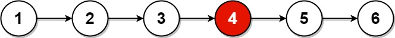

# 876. Middle of the Linked List

> Easy

------

Given the `head` of a singly linked list, return the middle node of the linked list.

If there are two middle nodes, return the second middle node.

**Example 1:**


```
Input: head = [1,2,3,4,5]
Output: [3,4,5]
Explanation: The middle node of the list is node 3.
```

**Example 2:**



```
Input: head = [1,2,3,4,5,6]
Output: [4,5,6]
Explanation: Since the list has two middle nodes with values 3 and 4, we return the second one.
```