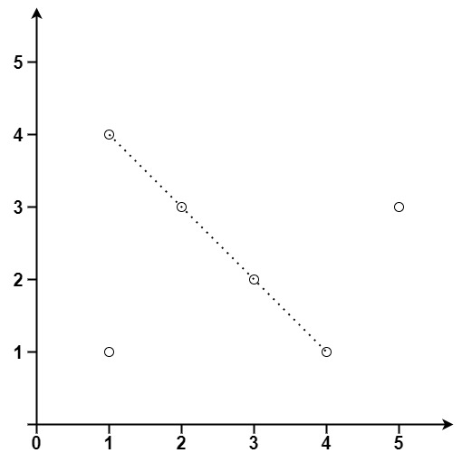

# 149. Max Points on a Line

> Hard

------

Given an array of `points` where `points[i] = [x_i, y_i]` represents a point on the X-Y plane, return the maximum number of points that lie on the same straight line.

**Example 1:**


```
Input: points = [[1,1],[2,2],[3,3]]
Output: 3
```

**Example 2:**



```
Input: points = [[1,1],[3,2],[5,3],[4,1],[2,3],[1,4]]
Output: 4
```

**Constraints:**

- All the points are unique.