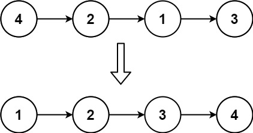

# 147. Insertion Sort List

> Medium

------

Given the `head` of a singly linked list, sort the list using insertion sort, and return the sorted list's head.

The steps of the insertion sort algorithm:

1. Insertion sort iterates, consuming one input element each repetition and growing a sorted output list.
2. At each iteration, insertion sort removes one element from the input data, finds the location it belongs within the sorted list and inserts it there.
3. It repeats until no input elements remain.

The following is a graphical example of the insertion sort algorithm. The partially sorted list (black) initially contains only the first element in the list. One element (red) is removed from the input data and inserted in-place into the sorted list with each iteration.


**Example 1:**



```
Input: head = [4,2,1,3]
Output: [1,2,3,4]
```

**Example 2:**


```
Input: head = [-1,5,3,4,0]
Output: [-1,0,3,4,5]
```