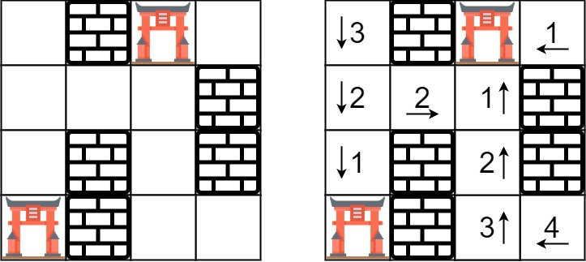

# 286. Walls and Gates

> Medium

------

You are given an `m × n` grid rooms initialized with these three possible values.

- `-1` is a wall or an obstacle.
- `0` is a gate.
- `INF` is an empty room. We use the value `2^31 - 1 = 2147483647` to represent `INF` as you may assume that the distance to a gate is less than `2147483647`.

Fill each empty room with the distance to its nearest gate. If it is impossible to reach a gate, it should be filled with `INF`.

**Example 1:**



```
Input: rooms = [[2147483647,-1,0,2147483647],[2147483647,2147483647,2147483647,-1],[2147483647,-1,2147483647,-1],[0,-1,2147483647,2147483647]]
Output: [[3,-1,0,1],[2,2,1,-1],[1,-1,2,-1],[0,-1,3,4]]
```

**Example 2:**

```
Input: rooms = [[-1]]
Output: [[-1]]
```