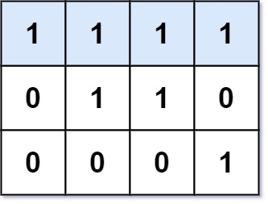

# 562. Longest Line of Consecutive One in Matrix

> Medium

------

Given an `m × n` binary matrix `mat`, return the length of the longest line of consecutive one in the matrix.

The line could be horizontal, vertical, diagonal, or anti-diagonal.

**Example 1:**


```
Input: mat = [[0,1,1,0],[0,1,1,0],[0,0,0,1]]
Output: 3
```

**Example 2:**



```
Input: mat = [[1,1,1,1],[0,1,1,0],[0,0,0,1]]
Output: 4
```

**Constraints:**

- `mat[i][j]` is either `0` or `1`.