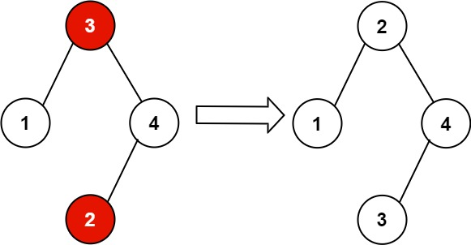

# 99. Recover Binary Search Tree

> Medium

------

You are given the `root` of a Binary Search Tree (BST), where exactly two nodes of the tree were swapped by mistake. Recover the tree without changing its structure.

**Example 1:**


```
Input: root = [1,3,null,null,2]
Output: [3,1,null,null,2]
Explanation: 3 cannot be a left child of 1 because 3 ＞ 1. Swapping 1 and 3 makes the BST valid.
```

Another accepted tree is:



**Example 2:**

```
Input: root = [3,1,4,null,null,2]
Output: [2,1,4,null,null,3]
Explanation: 2 cannot be in the right subtree of 3 because 2 ＜ 3. Swapping 2 and 3 makes the BST valid.
```